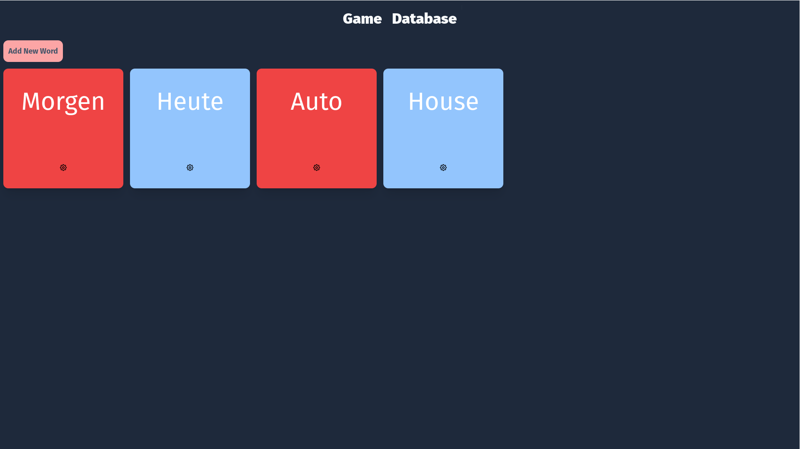

# Flashcards

Simple Flashcards for German and English created with React, Webpack and Babel

## Table of contents

- [General Info](#general-info)
- [Technologies Used](#technologies-used)
- [Features](#features)
- [Screenshots](#screenshots)
- [Setup](#setup)
- [Project Status](#project-status)
- [Room for Improvement](#room-for-improvement)
- [To do](#to-do)
- [Contact](#contact)

## General Info

This project was created to allow me to primarily learn how to build and set up a React project using Webpack and Babel.

This project was also created to be the ‘front end’ to an API that I created which can be found here: [dbAPI](https://github.com/jonathanwears/dbapi/ "Database API")

Currently the project uses mock data to function

## Technologies Used

Project is created with:

- React 17.0
- Webpack 5.75
- Babel 7.0
- Tailwind 4
- Zustand 4.3
- React Router 5.3

## Features

- Aid language learning with flashcards
- ‘Flip’ cards to see the German or English word

## Screenshots



## Setup

main channel has 'working' version
dev channel has more up to date code and features. However code may be incomplete, or not run at all.

To run this project, install it locally using npm:

```
$ cd ../flashcards
$ npm install
$ npm start
```

## Project Status

Project is: _in progress_

## Room for Improvement

- Organisation of project tree
- More consistency with modular component design

#### To Do:

- Create a game functionality
- Continue styling
- Add animations

## Contact

Created by me - feel free to contact me!
